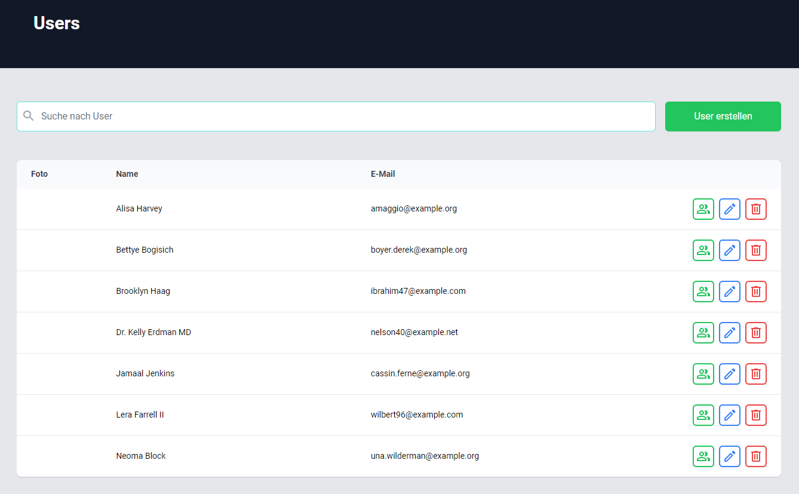

# User Managment Package



## # Install via Composer (default)

```bash
composer require reinholdjesse/usermanager
```

---

## Start Route

http://your_url/dashboard/user

```php
{{ route('package.users.manager.index'); }}
```

---

## # Install in App Root (optional)

Create new folder in your root aplication with name **packages/reinholdjesse/usermanager**.
Copy Package files in the folder.

**File** -> config\app.php

```php
/*
* Package Service Providers...
*/
    Reinholdjesse\Usermanager\UsermanagerServiceProvider::class,
/*
* Application Service Providers...
*/
```

**File** -> **App root folder** -> composer.json

```json
"autoload": {
    "psr-4": {
        "Reinholdjesse\\Usermanager\\": "packages/reinholdjesse/usermanager/src/",
        "App\\": "app/",
        "Database\\Factories\\": "database/factories/",
        "Database\\Seeders\\": "database/seeders/"
    }
},
```

### Install Required Packages

```bash
composer require lab404/laravel-impersonate
```

### Add User Model

```php
use Lab404\Impersonate\Models\Impersonate;

// User class
use Impersonate;
//

```

---

# # In your App include (optional)

## Step 1 (#Publish files)

```bash
php artisan vendor:publish --tag=usermanager
```

## Step 2 (#Add your Routes after published)

**File** -> routes/web.php

```php
Route::get('dashboard/user',[\App\Http\Controllers\UserController::class,'index']);
```
